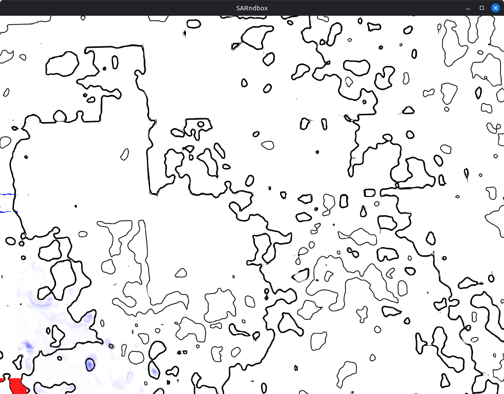
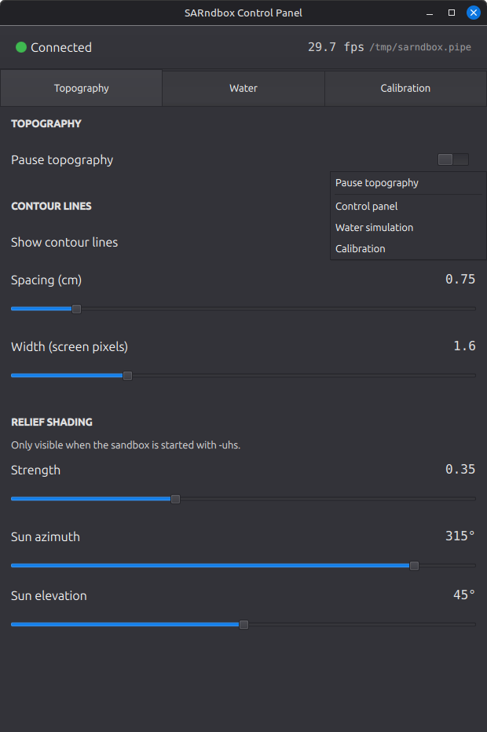
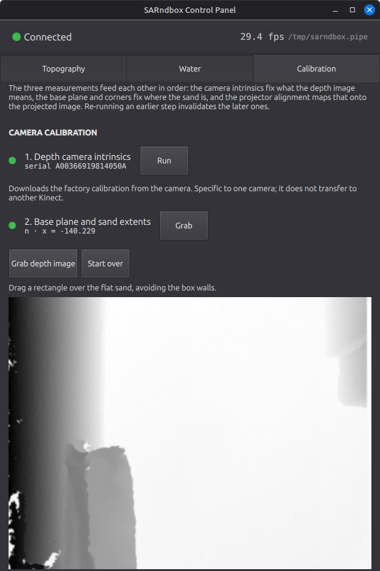
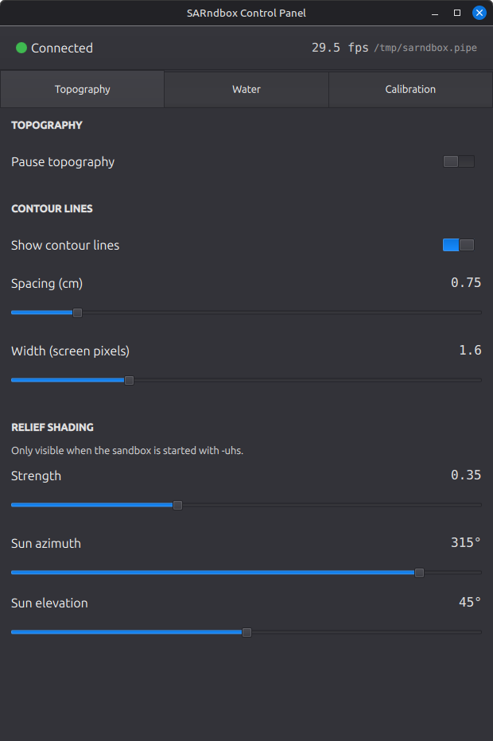
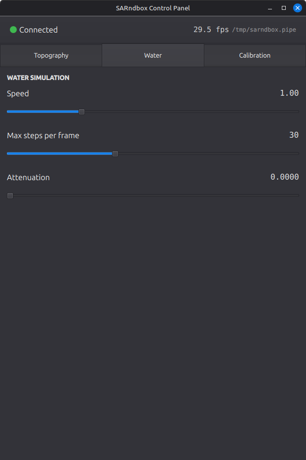

# ARSandbox

Augmented Reality Sandbox — a Kinect depth camera watches a box of sand, and a
projector paints a live topographic map, contour lines and a water-flow
simulation back onto it. Built on Oliver Kreylos's
[SARndbox](https://web.cs.ucdavis.edu/~okreylos/ResDev/SARndbox/) 2.8 and the
Vrui VR toolkit.



This repository holds the sandbox sources with local modifications, a Qt Quick
control panel, the calibration measured from this rig, and the documentation.

## Layout

| Path | Contents |
|------|----------|
| `sarndbox/` | SARndbox 2.8 sources with the changes described below |
| `control-panel/` | Qt Quick panel that drives a running sandbox |
| `config/` | Calibration and configuration for this rig |
| `docs/` | Documentation (Croatian) and images |
| `scripts/` | Launch helper |
| `install.sh` | One-shot installer for Debian/Ubuntu |

## Installing

```bash
./install.sh
```

It installs the build dependencies, builds and installs Vrui and its Kinect
package if they are not already present, then builds the sandbox and the control
panel. Vrui is built from the author's release rather than vendored here — it is
a large toolkit with its own release cadence, and carrying a copy would mean
maintaining a fork that silently drifts.

Useful overrides: `PREFIX` (default `/usr/local`), `SRCDIR` (default `~/src`),
`JOBS`, `QT_PREFIX` if Qt 6 lives somewhere CMake will not find.

Requirements: **Linux**, a Kinect v1 (Xbox 360), a projector above the box, and
Qt 6.4+ for the panel. See [macOS](#macos).

---

# Step by step

## 1. Start it

```bash
scripts/run-sandbox.sh
```

That creates the two control FIFOs, applies the sandbox's Vrui tool bindings and
starts the sandbox. On first run it will say:

```
No projector calibration yet; using the default projection.
```

That is expected — the projection is not aligned to the sand until step 5.

## 2. Open the control panel

**Right click** anywhere on the sandbox view. The panel opens if it is not
already running; if it is, you get a context menu:



The menu appears on the panel's screen rather than in the projection. A menu
drawn into the projection lands on the sand and is painted over by the
topography, which is why the original in-application menu was replaced.

Everything else is disabled. Vrui's stock bindings put navigation on left-drag,
the scroll wheel and `q/a/d/s/w/Space`, any of which would move the projection
off the sand — a visitor leaning on the keyboard could wreck a calibrated setup.
`config/SARndboxTools.cfg` unbinds all of it.

## 3. Camera intrinsics

Open the **Calibration** tab and run step 1. It downloads the factory
calibration from the camera itself. It is specific to one camera — the file is
named after the serial number and does not transfer to another Kinect.

## 4. Base plane and sand extents



Press **Grab depth image** to pull the current depth frame into the panel, then:

1. **Drag a rectangle** over the flat sand, staying clear of the box walls. The
   plane is fitted to that region only. This is the part that matters: a fit to
   the whole depth image cannot tell the sand from the rest of the room and
   settles on whatever surface dominates the view.
2. **Click the four corners** of the sand, in this order: bottom left, bottom
   right, upper left, upper right. Each click reports one 3D position.
3. Press **Write BoxLayout.txt**.

Nothing is written until that last press, so a misclick costs you a retry rather
than your calibration. The previous file is kept as `.bak`.

The panel then checks the result and says so plainly:

| Check | Means |
|---|---|
| Tilt off camera axis | The camera looks nearly straight down, so a good fit is a few degrees. A large angle means the fit caught a wall. |
| Corner fit residual | How far the corners lie from the fitted plane. |
| Opposite side mismatch | The box is rectangular, so opposite sides should match. A large value means a corner was misplaced. |

Each is a way a measurement comes out wrong while still producing a file that
loads — without them the sandbox just looks subtly off with nothing to point at.

## 5. Projector alignment

Still in the Calibration tab. Pick the projector from the dropdown — check it
against the projector's own specification, because a wrong pixel size produces a
defective calibration with no error reported. A screen rotated with `xrandr`
reports its rotated dimensions.

Press **Start**. The sandbox projects a crosshair. Put a flat circular target
with a marked centre — a CD with a paper disk glued on works — flat on the sand
with its centre on the crosshair, take your hands out of view, and press
**Capture this point**. The crosshair turns green when the target is found.
Repeat for all 12 points.

The RMS residual in projector pixels is reported at the end; that is the honest
measure of whether the capture was any good.

## 6. Run it



Contour spacing and width, relief shading, and the sun direction are all live —
no restart. Relief shading only shows with `-uhs`.



Water speed, step budget and attenuation are live too. If the simulation cannot
keep up it says so once every few seconds and tells you which knob to turn:

```
Water simulation is behind by 0.018 s per frame; raise waterMaxSteps
(currently 50) or lower waterTableSize in SARndbox.cfg
```

---

## How the two programs talk

The panel writes command lines to the FIFO the sandbox already parses, and the
sandbox reports state back on a second FIFO at the same path with `.status`
appended. `run-sandbox.sh` creates both; the sandbox creates them itself if
missing.

So the panel shows the sandbox's real state, not merely what it last sent — the
frame rate and pause toggle follow changes made anywhere. Status is pushed twice
a second, so a panel started late is correct as soon as it connects, and one that
goes quiet for a few seconds is reported as disconnected.

Either program can be restarted independently. The sandbox ignores `SIGPIPE` and
treats a missing panel as normal, so closing the panel cannot disturb a running
sandbox.

Every calibration file the sandbox writes is also copied to `config/`
(`calibrationMirrorDir` in `SARndbox.cfg`), so the tracked copy cannot fall
behind the one the running binary reads.

---

## Changes to SARndbox

**Anti-aliased contour lines.** The stock shader made a binary decision and wrote
opaque black, producing hard one-pixel aliased lines, and used a checkerboard
parity term that stippled shallow-slope contours into dashes. It now measures the
screen-space distance to the nearest contour and converts it to coverage, using
an elevation gradient computed analytically from the four corner samples it
already fetched. Adds index contours and fades lines where they crowd together,
which also removes a black smear on steep walls and a spurious ring at the edge
of the sand.

**Calibration moved into the application.** RawKinectViewer's two tools — fitting
a plane to a selected region, and extracting 3D positions by clicking — are now
in the sandbox and driven from the panel, along with the projector calibration
ported from `CalibrateProjector`. The external tools are still there if you want
them.

**Relief shading works.** The fixed light source upstream left disabled is now
created when hill shading is on, aimed from a configurable azimuth and elevation
(default 315°/45°, the cartographic convention). Shading is a partial blend
toward the lit colour rather than full Lambertian, so the elevation colour map
keeps its saturation. Surface normals use a ±2 pixel central difference instead
of ±1, which was a high-pass filter on residual depth noise and the main cause of
shading speckle.

**Fixed a buffer overflow.** `SurfaceRenderer::DataItem::heightMapShaderUniforms`
was sized 16 but received 17 uniform locations when the colour map, contour
lines, dipping bed, hill shading and water table were all enabled, overwriting
the adjacent shader-rebuild counter.

**Water grid squared.** The base plane domain is 69.64 × 87.43 cm, so the stock
640×480 grid gave cells 1.67× longer along one axis. It is now 512×643 —
square cells, and 0.86× the work of the stock grid.

**Depth filter retuned** — 15 averaging slots instead of 30, halving latency from
about 1.0 s to 0.5 s.

**Live control** of contour width, relief strength, sun direction, pause and the
whole calibration flow, over the control pipe.

Full detail, in Croatian, in [docs/dokumentacija-instalacija-vrui.md](docs/dokumentacija-instalacija-vrui.md).

---

## Tuning

Three shader files are watched at runtime — `SurfaceAddContourLines.fs`,
`SurfaceIlluminate.fs` and `SurfaceAddWaterColor.fs`. Editing one takes effect in
the running sandbox with no rebuild and no restart, and a syntax error leaves the
previous shader in place rather than crashing.

---

## macOS

**The sandbox requires Linux. The control panel builds and runs on both.**

Vrui's macOS path exists but is X11-only and unmaintained since about 2017, with
several hard build errors in the 8.0 Darwin path; fullscreen onto a projector
through XQuartz is unreliable, and the Kinect's isochronous transfers are
libusb's least dependable macOS route. The OpenGL requirements would actually be
met by the legacy 2.1 profile, but that only gets to the starting line.

The release workflow builds `sandbox-control` for macOS. Reasoning and evidence:
[docs/macos.md](docs/macos.md).

---

## Licence

SARndbox and Vrui are GPL v2; see `sarndbox/COPYING`. The control panel is part
of this repository and carries the same licence.
